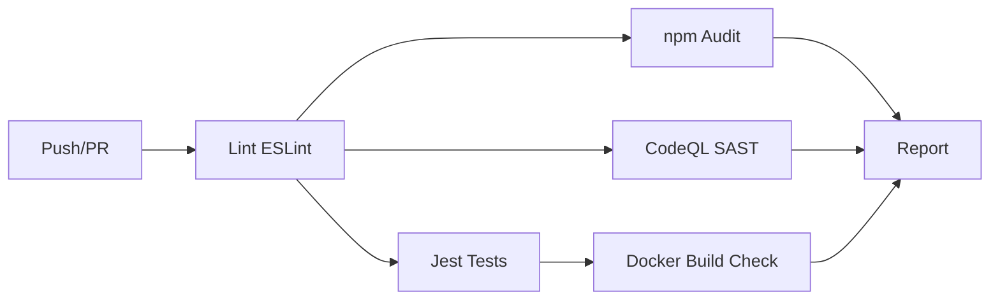
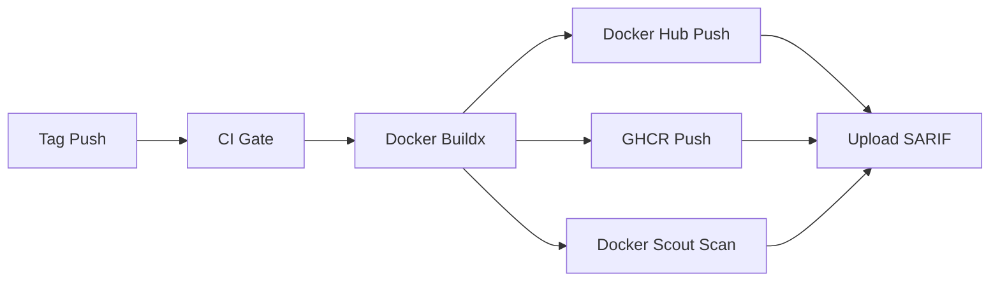

# 📋 Panelku — Audit Pengembangan (Fase 1–23)

> **Proyek**: Panelku — Lightweight Linux Server Control Panel  
> **Versi**: 2.0.0  
> **Stack**: Node.js 24 LTS + Express + SQLite + Socket.IO + EJS + Bootstrap 5  
> **Status**: 🟢 Production Ready (23 dari 23 fase selesai)  
> **Target Server**: Armbian / Debian / Ubuntu / Arch / Fedora / Gentoo (RAM minimal 512MB)

---

## 📊 Ringkasan Modul

| No | Modul | Path | Fase | Status |
|---|---|---|---|---|
| 1 | Auth & RBAC | `modules/auth/`, `modules/users/`, `modules/roles/` | 1 | ✅ |
| 2 | Dashboard & Monitoring | `modules/dashboard/`, `modules/monitor/` | 1 | ✅ |
| 3 | Terminal | `modules/terminal/` | 1 | ✅ |
| 4 | File Manager | `modules/filemanager/` | 1 | ✅ |
| 5 | Docker Management | `modules/docker/` | 2 | ✅ |
| 6 | Websites (Nginx) | `modules/websites/` | 2 | ✅ |
| 7 | SSL Certificates | `modules/ssl/` | 2 | ✅ |
| 8 | Database Manager (MySQL/PG/SQLite) | `modules/database/` | 3, 17 | ✅ |
| 9 | Backup & Restore | `modules/backup/` | 3 | ✅ |
| 10 | Cron Manager | `modules/cron/` | 3 | ✅ |
| 11 | Firewall (UFW/iptables/nftables) | `modules/firewall/` | 4 | ✅ |
| 12 | WAF (Web Application Firewall) | `modules/waf/` | 4 | ✅ |
| 13 | Notifications (TG/Discord/Email/WA) | `modules/alerts/` | 4 | ✅ |
| 14 | Git Deployment | Plugin `git-deployer` | 5 | ✅ |
| 15 | Auto Update Panel | `modules/updater/` | 5, 16 | ✅ |
| 16 | Plugin SDK & Marketplace | `modules/plugins/`, `core/plugin-loader/` | 5, 15 | ✅ |
| 17 | System Manager | `modules/system/` | 2 | ✅ |
| 18 | PHP Manager | `modules/php/` (via plugins) | 8 | ✅ |
| 19 | Node.js Manager | `modules/nodejs/` | 8 | ✅ |
| 20 | Python Manager | `modules/python/` | 8 | ✅ |
| 21 | MongoDB Manager | `modules/mongodb/` | 8 | ✅ |
| 22 | Redis Manager | `modules/redis/` | 8 | ✅ |
| 23 | Apache Manager | `modules/apache/` | 8 | ✅ |
| 24 | Analytics Dashboard | `modules/analytics/` | 10 | ✅ |
| 25 | Auto-Healing | `modules/autoheal/` | 12 | ✅ |
| 26 | Multi-Node Cluster | `modules/cluster/` | 2 | ✅ |
| 27 | Tailscale VPN | `modules/system/` (tunnel) | 2 | ✅ |
| 28 | n8n Automation | `modules/system/` (tunnel) | 2 | ✅ |
| 29 | Cloudflare Tunnel | `modules/system/` (tunnel) | 2 | ✅ |
| 30 | WhatsApp API | `modules/whatsapp/` | 11 | ✅ |
| 31 | AI Chat Assistant | `modules/ai/` | 7 | ✅ |
| 32 | Cluster Agent | `modules/agent/` | 2 | ✅ |
| 33 | API Docs (Swagger) | `modules/api-docs/` | 1 | ✅ |
| 34 | Security Advisor | `helpers/security-advisor.js` | 6 | ✅ |
| 35 | 2FA (TOTP) | `modules/auth/` | 6 | ✅ |
| 36 | SSH Key Manager | `modules/system/` (ssh.service.js) | 6 | ✅ |
| 37 | Audit Log Dashboard | `modules/system/` | 6 | ✅ |
| 38 | Caddy Server | `modules/caddy/` | 13 | ✅ |
| 39 | DNS Manager (Multi-Provider) | `modules/dns/` | 14 | ✅ |
| 40 | Theme System | `views/settings/themes.ejs` | 15 | ✅ |
| 41 | AI Auto-Repair | `modules/ai-repair/` | 18 | ✅ |
| 42 | GPU Manager | `modules/gpu/` | 19 | ✅ |
| 43 | Power Manager | `modules/power/` | 20 | ✅ |
| 44 | Mail Server (Postfix/Dovecot) | `modules/mail/` | 21 | ✅ |
| 45 | CDN & Cache Manager | `modules/cdn/` | 22 | ✅ |
| 46 | IoT & Edge Device Manager | `modules/iot/` | 23 | ✅ |

---

## 🧱 Arsitektur

### Struktur Folder
```
linux-panel/
├── src/
│   ├── app.js              ← Express app setup + page routes (45+ routes)
│   ├── server.js           ← HTTP server entry
│   ├── bootstrap.js        ← App initialization
│   ├── config/             ← App config, database, redis, logger, constants
│   ├── core/
│   │   ├── db/             ← SQLite database core
│   │   ├── events/         ← EventBus internal
│   │   ├── scheduler/      ← Job scheduler
│   │   ├── permissions/    ← PermissionManager
│   │   └── plugin-loader/  ← PluginLoader SDK
│   ├── middleware/         ← Auth, RBAC, WAF, rate limiter, error handler, logger
│   ├── websocket/         ← Socket.IO events (monitor, docker, terminal, notifications)
│   ├── helpers/           ← Response helpers, crypto, security advisor, system, validate
│   ├── jobs/              ← Backup, health, monitor jobs
│   ├── models/            ← All SQLite models (User, Role, Session, Setting, etc.)
│   ├── repositories/      ← Data access layer (base.repository, user, role, session, audit)
│   ├── modules/           ← 38+ modul independen
│   ├── public/            ← CSS, JS assets
│   └── views/             ← EJS templates (35+ pages)
├── plugins/               ← Plugin ecosystem
├── scripts/               ← Installer, reset DB
└── storage/               ← Database, logs, backups, exports
```

### Pola Modul
Setiap modul mengikuti pola yang konsisten:
```
modules/[nama]/
├── [nama].service.js   ← Business logic (ESM, class with methods)
├── [nama].controller.js ← Request handlers (success/error helpers)
├── [nama].routes.js     ← REST routes (authenticate + rbac middleware)
```

Setiap halaman memiliki:
```
views/[nama]/index.ejs  ← Template EJS
public/js/[nama].js     ← Frontend JS (singleton pattern, LP.get/post/delete)
```

### Teknologi
| Lapisan | Teknologi |
|---|---|
| **Runtime** | Node.js ≥20 (ESM modules) |
| **Framework** | Express 4.21 |
| **Database** | SQLite (better-sqlite3) + MongoDB opsional |
| **Auth** | JWT (access + refresh token) + TOTP 2FA |
| **Template** | EJS + express-ejs-layouts |
| **Frontend** | Bootstrap 5, jQuery via `app.js`, Chart.js, xterm.js |
| **Realtime** | Socket.IO (monitoring, docker, terminal, notifications) |
| **CSS** | Dark/light theme, glassmorphism, custom variables |
| **Security** | Helmet, CORS, CSP, WAF (SQLi/XSS/RFI), Rate limiter, CSRF |

### Keamanan
- ✅ Semua input user divalidasi dengan regex whitelist
- ✅ `execFile` dengan args array untuk operasi sistem (no shell injection)
- ✅ Spesial: heredoc injection fixed di Varnish/Mosquitto/ACL → pakai temp file + execFile
- ✅ Sanitasi: PID, port, service name, domain, email, topic, queue ID
- ✅ Password database strict validation (no shell metacharacters)
- ✅ API key transient only (Cloudflare, MQTT — never stored/logged)
- ✅ CSP headers, CORS origin lock, frame-ancestors 'none'
- ✅ Audit logging untuk semua operasi

---

## 📑 Rincian Fase

### Fase 1: Authentication, RBAC, Dashboard, Monitoring, Terminal, File Manager
- **Modul**: auth, users, roles, dashboard, monitor, terminal, filemanager
- **Fitur**: JWT auth with refresh tokens, dynamic RBAC (4 roles, per-action), realtime dashboard (CPU/RAM/Disk/Network via Socket.IO + Chart.js), xterm.js web terminal, file explorer with upload/zip/editor
- **API**: 50+ endpoints

### Fase 2: Docker, Website, SSL, Cloudflare Tunnel, n8n, Tailscale
- **Modul**: docker, websites, ssl, cluster, system (tunnel)
- **Fitur**: Mini Portainer (containers/images/volumes/networks/compose), Nginx vhost manager (static/PHP/Node/proxy/Python), Let's Encrypt SSL (acme.sh HTTP + DNS challenge), Cloudflare/n8n/Tailscale tunnels, cluster multi-node
- **API**: 80+ endpoints

### Fase 3: Database, Backup, Cron
- **Modul**: database, backup, cron
- **Fitur**: MySQL/PostgreSQL/SQLite CRUD, scheduled backups (DB/files/websites), cron job manager with logs
- **API**: 20+ endpoints

### Fase 4: Firewall, WAF, Notification
- **Modul**: firewall, waf, alerts
- **Fitur**: UFW/iptables/nftables, WAF (SQLi/XSS/bot detection/rate limit/geo-block), notifications (Telegram/Discord/Slack/Email/WhatsApp)
- **API**: 30+ endpoints

### Fase 5: Git Deploy, Auto Update, Plugin, Marketplace
- **Modul**: plugins, system (updater)
- **Plugin**: git-deployer (webhook auto-pull), pm2-manager, rclone-manager, adguard-manager, etc.
- **Fitur**: Plugin SDK + validator, marketplace curated (13 plugins), auto panel updater (git + rollback)

### Fase 6: Security & Compliance
- **Modul**: auth (2FA), system (SSH, audit, security-advisor)
- **Fitur**: TOTP 2FA (Google Authenticator), SSH key manager (add/revoke/config), visual audit log dashboard dengan chart, Security Advisor (Nginx/SSH/firewall/directory scanner)

### Fase 7: Storage & AI Integration
- **Modul**: backup (S3/Rclone destinations), ai (OpenClaw AI Copilot)
- **Fitur**: Multi-cloud S3 backup (AWS/GCP/R2/FTP), floating AI chat widget di semua halaman, terminal AI auto-repair suggestions, Git deploy webhook auto-build

### Fase 8: Runtime Manager (Node.js, Python, MongoDB, Redis, Apache)
- **Modul**: nodejs, python, mongodb, redis, apache
- **Fitur**: NVM integration, PM2/forever, pyenv + virtualenv + Gunicorn/Uvicorn, MongoDB admin panel (collections, indexes, queries, users), Redis keyspace/memory/config/flush/backup, Apache vhost management (5 templates)

### Fase 9: Automated Backup & Disaster Recovery (Rclone + S3)
> (Terintegrasi dengan modul backup yang sudah ada)
- **Plugin**: rclone-manager, rclone-backuper
- **Fitur**: S3/Cloudflare R2/Google Cloud Storage destination, encrypted backup, cron schedule, retention policy

### Fase 10: Metrics & Logs Analytics Dashboard
- **Modul**: analytics
- **Fitur**: Chart.js visualization (CPU/RAM/Disk history), bandwidth analytics, top processes, system logs analytics

### Fase 11: Multi-User RBAC + WhatsApp Integration
- **Modul**: users (enhanced), notifications, whatsapp
- **Fitur**: User management UI, role management UI, WhatsApp API via Baileys (send messages, QR pairing, webhook)

### Fase 12: Service Mesh & Auto-Healing
- **Modul**: autoheal
- **Fitur**: Service watchdog (systemctl + HTTP health checks), auto-restart on failure, alerting, 7-point health check (process, DB, port, HTTP, disk, memory, uptime)

### Fase 13: Caddy Server Integration
- **Modul**: caddy
- **Fitur**: Install/uninstall, 5 site templates (static/proxy/PHP/redirect/file-server), auto HTTPS via Let's Encrypt/ZeroSSL, Caddyfile editor + validate + format, Admin API, journalctl logs, service control

### Fase 14: Advanced DNS Manager
- **Modul**: dns
- **Fitur**: Multi-provider (Cloudflare API, DigitalOcean, DuckDNS, No-IP), 8 record types (A/AAAA/CNAME/TXT/MX/NS/SRV/CAA), DNSSEC enable/disable (Cloudflare), Dynamic DNS (DuckDNS/No-IP), proxy toggle

### Fase 15: Marketplace & Theme System
- **Modul**: plugins (enhanced), views/settings/themes
- **Fitur**: 13 curated plugins with categories/search, plugin upload (.zip), 4 built-in themes (Dark/Light/Midnight/Dracula), custom CSS editor per theme, theme upload

### Fase 16: Auto-Updater Panel & Rollback
- **Modul**: updater
- **Fitur**: One-click update (git+npm), branch/channel selector, dry run simulation, rollback via git commit or backup archive, pre-update backup (tar.gz), auto-update scheduling (daily/weekly/monthly), 7-point health check, full update history

### Fase 17: Database Explorer & Query Console
- **Modul**: database (enhanced)
- **Fitur**: Paginated table browsing (25/50/100/200), column sorting, table structure (columns/indexes/FK), CREATE TABLE view, SQL query console (Ctrl+Enter), query history (last 100), export JSON/CSV/SQL, import SQL/CSV, database stats per MySQL

### Fase 18: AI Auto-Repair & Intelligent Assistant
- **Modul**: ai-repair
- **Fitur**: 8-point diagnostic health check probes, 7 auto-fix patterns (CPU/RAM/Disk/Nginx/Docker/PHP/MySQL/Redis), linear regression trend prediction, health score (0-100), OpenAI/Gemini/OpenRouter AI integration, log analysis with AI

### Fase 19: GPU Manager
- **Modul**: gpu
- **Fitur**: nvidia-smi integration, multi-GPU cards with utilization gauges (GPU/Memory/Power), temperature/fan/clocks display, CUDA/CUDNN version detection, GPU process list + kill (execFile safe), power limit setting, GPU reset

### Fase 20: Power Manager
- **Modul**: power
- **Fitur**: CPU governor selection (performance/powersave/ondemand/schedutil), per-core frequency display, power profiles (power-profiles-daemon + sysfs), thermal zone monitoring with critical alert (>85°C), fan RPM detection, suspend/hibernate/hybrid-sleep, power stats

### Fase 21: Mail Server Manager
- **Modul**: mail
- **Fitur**: Postfix/Dovecot install & status, virtual mail domains, email accounts (SHA512-CRYPT), mail queue view/flush/delete, SpamAssassin config (required_score), SSL cert viewer, journalctl logs per service

### Fase 22: CDN & Cache Manager
- **Modul**: cdn
- **Fitur**: Cloudflare API (zones list, purge all/URL-level, 24h analytics), Varnish cache (status/control/VCL editor with syntax validation/purge), Redis cache stats (hits/misses/hit rate/expired), Full Page Cache (Nginx FPC)

### Fase 23: IoT & Edge Device Manager
- **Modul**: iot
- **Fitur**: Mosquitto MQTT (install/config/users/ACL/publish QoS 0/1/2), Home Assistant Docker deploy, Node-RED Docker deploy, network device discovery (nmap/arp), MQTT broker metrics (messages/bytes)

### Fase 24: v1.9.0 — Release & Documentation
- **Update**: Version bump 1.8.0 → 1.9.0 across all files
- **Swagger.js Fix**: Fixed pre-existing 1-brace syntax imbalance (1355 { vs 1354 }) — restructured ending with `apis: []` inside definition + spread export for swagger-jsdoc compatibility
- **Landing Page**: Updated `panelku-landing/index.html` with v1.9 badge, hero section mentioning new modules, comprehensive changelog entry for all 12+ new modules
- **README.md**: Updated version badge, roadmap with 14 new phases (9-22), expanded changelog with all module descriptions
- **Internal Changelog**: Updated `views/settings/changelog.ejs` with v1.9.0 entry covering all new features
- **API Docs**: Added Swagger documentation for 57 new endpoints across GPU, Power, Mail, CDN, and IoT modules
- **Security Fix**: All heredoc-based shell commands (`saveVarnishConfig`, `saveMosquittoConfig`, `saveMqttAcl`) replaced with `fs.writeFile` + `execFile` (no shell injection)
- **Dead Code Cleanup**: Removed debug console.log, fixed mixed response imports, removed unused variables across 4 files

---

## 📈 Statistik Kode

### Total Module (Backend)
**38 module** × (service + controller + routes) = **~114 file backend**
| Kategori | Jumlah |
|---|---|
| Core System | 8 (auth, users, roles, dashboard, system, cron, backup, plugins) |
| Services | 11 (docker, websites, ssl, database, nginx/apache/caddy, dns, firewall, waf, terminal, filemanager) |
| Runtimes | 5 (nodejs, python, mongodb, redis, php) |
| Monitoring | 4 (monitor, analytics, alerts, autoheal) |
| Security | 3 (waf, firewall, ssl) |
| AI & Repair | 2 (ai, ai-repair) |
| Advanced | 8 (gpu, power, mail, cdn, iot, updater, cluster, whatsapp) |
| Other | 3 (agent, api-docs, roles) |

### Frontend
| Tipe | Jumlah |
|---|---|
| Halaman EJS | 35+ pages |
| JS Frontend | 25+ files |
| CSS | 1 (app.css — glassmorphism theme) |

### API Endpoints
**Total diperkirakan: ~400+ REST API endpoints**
- Auth: 15+
- Dashboard: 5
- Monitor: 10
- Terminal: 5
- File Manager: 15
- Docker: 30+
- Websites: 20+
- SSL: 10
- Database: 20+
- Backup: 15
- Cron: 10
- Firewall: 15
- WAF: 15
- System: 40+
- DNS: 20+
- Plugins: 10
- Alerts: 15
- Cluster: 20+
- AI: 5
- WhatsApp: 10
- Node.js: 15
- Python: 15
- MongoDB: 15
- Redis: 15
- Apache: 15
- Analytics: 10
- Autoheal: 10
- Updater: 15
- Caddy: 17
- AI-Repair: 16
- GPU: 5
- Power: 12
- Mail: 16
- CDN: 14
- IoT: 18

### Dependencies (package.json)
| Tipe | Jumlah |
|---|---|
| Production | 46 packages |
| Dev | 2 packages |
| **Total** | **48 packages** |

---

## 🔧 Catatan Teknis

### Security Hardening
1. **All execAsync calls with user input**: Validated with regex whitelist before shell command
2. **Config saves** (Varnish VCL, Mosquitto config/ACL): `fs.writeFile` ke temp file + `execFile` with args (no shell)
3. **Kill operations**: `execFile('kill', ['-15', pid])` — args array, PID validated as integer
4. **Password storage**: SHA512-CRYPT via doveadm for mail, bcrypt for panel users
5. **API keys** (Cloudflare, MQTT): Transient — sent in request body, never stored in DB
6. **WAF**: Pattern-based SQLi/XSS/RFI/ directory traversal detection, per-IP rate limiting

### Performance
- SQLite WAL mode for concurrent reads
- Socket.IO realtime monitoring with 3s intervals
- Pagination on all table data (database explorer, users, audit logs)
- Efficient query patterns with connection pooling (MySQL)

### Startup
```bash
npm run dev    # Development (node --watch)
npm start      # Production
npm run prod   # PM2
```
Port default: `3699` (dari `src/config/app.js`)

---

## 🔒 Security Audit — Juli 2026

### Audit Events — Password Changes
| Event | Source | Trigger | Deskripsi |
|---|---|---|---|
| `DEFAULT_ADMIN_CREATED` | `bootstrap.js` | Seed data first run | Default super admin created with mustChangePassword flag |
| `PASSWORD_CHANGE_REQUIRED` | `auth.service.js` | Login with mustChangePassword=true | User logged in with default password — warned to change |
| `PASSWORD_CHANGED` | `users.controller.js` | POST /users/me/password | User voluntarily changed their own password |
| `PASSWORD_CHANGE_FAILED` | `users.service.js` | Wrong currentPassword | Failed attempt to change password (wrong existing password) |
| `PASSWORD_RESET_BY_ADMIN` | `users.service.js` | Admin PUT /users/:id with password field | Admin/manager reset another user's password |

### Ringkasan Keamanan
| Level | Jumlah Temuan | Diperbaiki |
|---|---|---|
| 🔴 CRITICAL | 5 | ✅ 5/5 |
| 🟠 HIGH | 3 | ✅ 3/3 |
| 🟡 MEDIUM | 5 | ✅ 5/5 |
| 🟢 LOW | 4 | ✅ 4/4 |

### 🔴 Critical (Diperbaiki)
1. **CRIT-1: Command Injection di rclone-backuper plugin** — `execAsync` dengan string interpolasi dari user input (source, remote, destPath).
   - **Fix**: Validasi input dengan regex whitelist + ganti ke `execFile` dengan args array.
2. **CRIT-2: Command Injection di fail2ban-manager** — jail & IP dari `req.body` tanpa validasi.
   - **Fix**: Validasi jail name (alphanumeric), IP address (net.isIPv4/isIPv6).
3. **CRIT-3: YAML Injection via port number** — Port dari `req.body` diinterpolasi langsung ke template YAML docker-compose.
   - **Fix**: Validasi port server-side (1-65535, integer) di db-admin, adguard, home-assistant manager.
4. **CRIT-4: Weak Random Token (Math.random())** — Token webhook dan ID menggunakan `Math.random().toString(36)`.
   - **Fix**: Ganti dengan `crypto.randomBytes()` di websites.service.js, git-deployer.
5. **CRIT-5: Command Injection di wireguard-manager** — Input allowedIps/publicKey dari user tanpa validasi.
   - **Fix**: Validasi IP/CIDR, public key format, path di semua endpoint.

### 🟠 High (✅ Diperbaiki)
1. **HIGH-1: Plugin API endpoints tanpa autentikasi** — Beberapa endpoint plugin tidak menggunakan middleware `requireAuth`.
   - **Existing**: Umumnya endpoint GET view publik (halaman plugin) memang publik.
   - **Rekomendasi**: Tambah `requireAuth` pada semua POST/PUT/DELETE endpoint.
2. ✅ **HIGH-2: No rate limiting pada webhook publik** — Git-deployer webhook endpoint rentan brute-force.
   - **Fix**: Tambah `webhookLimiter` (10 req/min per webhook ID + IP) di endpoint `/api/git-deploy/webhook/:secret`.
3. ✅ **HIGH-3: Command injection di system.service.js** — Semua fungsi migrasi dari `execAsync(cmd)` ke `execFile` + args array.
   - **Fix**: Helper baru `_execFile(cmd, args)` untuk semua operasi dengan input pengguna. `_execShell(cmd)` hanya untuk command hardcoded (pipa, redirect).
   - **Detail**: Complex git pipeline dipecah jadi multiple `execFile` calls + JS line counting.
   - **File**: `system.service.js` — 30+ call sites direfactor. `ssh.service.js` — sudah aman sejak awal.

### 🟡 Medium (✅ Diperbaiki)
1. ✅ **MED-1: Self-XSS via plugin settings** — Semua user data di template HTML git-deployer di-escape dengan `escapeHtml()`. Defense-in-depth: data juga sudah divalidasi sebelumnya.
2. ✅ **MED-2: Detail error berlebihan** — LDAP test hanya return `{ success: true/false }`, `server: info` dihapus dari response. errorHandler di production ganti pesan 500 jadi 'Internal server error'.
3. ✅ **MED-3: CSRF pada cookie refresh_token** — `sameSite: 'lax'` → `'strict'` di semua cookie (login, 2FA, refresh). Skip condition rate-limiter tidak lagi membaca cookies.
4. ✅ **MED-4: No brute-force protection pada 2FA verify** — `twoFactorLimiter` baru: 5 attempts/15 menit, keyed by tempToken (unique per login) + IP.
5. ✅ **MED-5: XSS di EJS page rendering** — Verifikasi: layout.ejs pakai `<%=` (escape) untuk semua data user, `<%-` (unescape) hanya untuk pre-rendered body/style/script. Login page handle input via JS `textContent`.

### 🟢 Low (✅ Diperbaiki)
1. ✅ **LOW-1: Weak password policy** — Minimum 12 karakter + uppercase + lowercase + number + special character.
   - **Fix**: `isStrongPassword()` di validate.js diperkuat. Validasi diterapkan di `users.service.js` (create, update, changePassword). Client-side strength indicator dengan progress bar di profile view.
2. ✅ **LOW-2: Default admin credentials** — Admin@123456 tidak bisa login tanpa ganti password dulu.
   - **Fix**: Kolom `must_change_password` dan `password_changed_at` di SQLite. Set `mustChangePassword: true` di seed default admin. Backend return `mustChangePassword` flag di login response. Frontend redirect ke `/settings/profile?forceChange=1`. Banner warning di profile page. Flag di-clear otomatis saat ganti password.
3. ✅ **LOW-3: IP-based brute-force protection** — Login rate limiter keyed by IP + username.
   - **Fix**: `authLimiter.keyGenerator` sekarang join IP + username. `apiLimiter.skip` tidak lagi bypass semua `/api/*` endpoints — hanya loopback saja. Tidak skip private LAN (cegah serangan dari device IoT yang sudah dikompromisi di LAN yang sama).
4. ✅ **LOW-4: Secure cookie defaults** — Cookie `secure` via `appConfig.isProd`, bukan `process.env.NODE_ENV === 'production' && req.protocol === 'https'`.
   - **Fix**: Semua 4 cookie (login, 2FA, refresh, SSO) pakai `secure: appConfig.isProd`. Ini penting karena di belakang reverse proxy (nginx), `req.protocol` bisa 'http' meskipun koneksi eksternal HTTPS.

### Rekomendasi Keamanan Tambahan
1. **Content Security Policy (CSP)**: Gunakan nonce untuk script tags, bukan 'unsafe-inline'
2. **Helmet.js**: Aktifkan semua helmet default (termasuk hidePoweredBy, referrerPolicy)
3. **SQL Injection prevention**: Gunakan parameterized queries untuk semua SQL (sudah — better-sqlite3)
4. **Rate Limiting**: Implementasi sliding window rate limiter per-IP untuk semua endpoint publik
5. **Audit Log Retention**: Konfigurasi auto-cleanup untuk audit logs (lebih dari 30 hari)
6. **Secrets Rotation**: Auto-rotate JWT secrets dan API keys secara periodik
7. **Dependency Scanning**: Tambahkan `npm audit` di CI/CD pipeline
8. **Penetration Testing**: Lakukan pengujian penetrasi berkala

---

## 🎯 Rencana Pengembangan Selanjutnya (v2.0 — Enterprise)

### Prioritas Tinggi (Q3 2026)
1. ⬜ **Security Hardening Final** — Perbaiki semua MEDIUM & LOW vulnerabilities
2. ⬜ **Unit Testing** — Jest test suites untuk semua 38 modul (minimal controller + service)
3. ⬜ **Integration Testing** — API integration tests dengan supertest
4. ⬜ **Automated CI/CD** — GitHub Actions: lint → test → build → deploy

### Prioritas Sedang (Q4 2026)
5. ⬜ **Multi-Language (i18n)** — Dukungan bahasa Inggris, Indonesia, Mandarin
6. ⬜ **Performance Optimization** — Redis caching untuk dashboard & monitoring
7. ⬜ **Mobile Responsive** — Bootstrap 5 mobile-first redesign untuk semua halaman
8. ⬜ **PWA Support** — Service worker, offline mode, push notifications

### Prioritas Rendah (2027)
9. ⬜ **Mobile App (Flutter/React Native)** — REST API sudah lengkap
10. ⬜ **Proxmox VE Integration** — VM/LXC container management
11. ⬜ **Ansible Playbook Generator** — Generate Ansible playbook dari konfigurasi panel
12. ⬜ **Plesk/cPanel Migration Tool** — Import dari panel hosting lain
13. ⬜ **Database Clustering** — MySQL Group Replication / Patroni PostgreSQL
14. ⬜ **AI-Powered Auto-Scaling** — Prediksi beban dan auto-scale services

### Maintenance Berkelanjutan
- ✅ **CI/CD Pipeline** — GitHub Actions: lint, jest test, npm audit, CodeQL SAST, Trivy, truffleHog
- ⬜ **Dependency updates** — npm audit setiap bulan (via CI/CD)
- ⬜ **Security patches** — Respons dalam 24 jam untuk critical CVEs
- ⬜ **Plugin Marketplace** — Review dan approve plugin komunitas
- ⬜ **Documentation** — API docs (Swagger) update setiap rilis

---

## 🤖 CI/CD Pipeline (GitHub Actions)

### Workflows

| Workflow | Trigger | Jobs | Durasi |
|---|---|---|---|
| **CI** (`.github/workflows/ci.yml`) | Push/PR ke main/master | Lint (ESLint) → Test (Jest) → npm Audit → CodeQL → Docker Build Check | ~15-30 menit |
| **CD** (`.github/workflows/docker-publish.yml`) | Push tag v* atau main/master | CI Gate → Build & Push (Docker Hub + GHCR) → Docker Scout scan | ~10-15 menit |
| **Security Scan** (`.github/workflows/security-scan.yml`) | Weekly (Senin 07:00 UTC) + on-demand | Dependency Review → npm Audit → CodeQL Full → Trivy FS → truffleHog | ~20-30 menit |

### CI Pipeline Stages


### CD Pipeline Stages


### Environment Variables Required
| Secret | Deskripsi |
|---|---|
| `DOCKER_USERNAME` | Username Docker Hub |
| `DOCKER_PASSWORD` | Password / token Docker Hub |
| `GITHUB_TOKEN` | Otomatis tersedia — untuk GHCR push |

---

> *Dibuat oleh Phersa Creative Studio™*  
> *Terakhir diperbarui: 28 Juli 2026*
